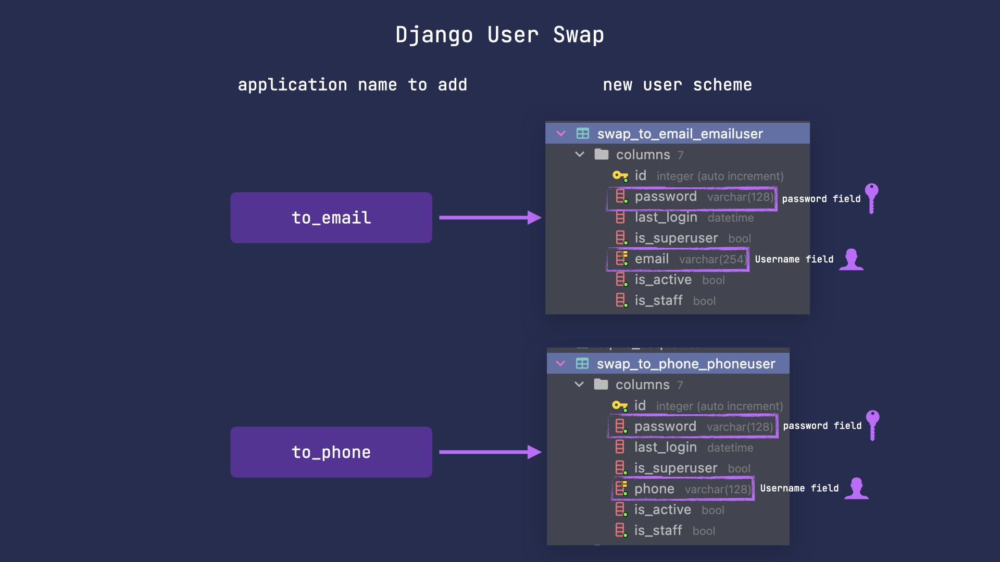

# Overview
This package  allows you easily change your default user's fields to email or phone along with additional functionality such one time passwords.
✨🐍

## Email and Phone fields as username
Basic functionality provided by this package includes user models with `phone` or `email` as username.


To use specified model follow the steps below.
### Step 1 - change `INSTALLED_APPS`
Add the following apps below to `INSTALLED_APPS` in order to swap to the specified model.

=== "to_email"

    ``` python
    "swap_user",
    "swap_user.to_email",
    ```

=== "to_phone"

    ``` python
    "swap_user",
    "swap_user.to_phone",
    ```

---

### Step 2 - change `AUTH_USER_MODEL`
=== "to_email"

    ``` python
    AUTH_USER_MODEL = "swap_to_email.EmailUser"
    ```

=== "to_phone"

    ``` python
    AUTH_USER_MODEL = "swap_to_phone.PhoneUser"
    ```

---

### Step 3 - apply migrations
=== "to_email"

    ``` sh
    python manage.py migrate swap_to_email
    ```

=== "to_phone"

    ``` sh
    python manage.py migrate swap_to_phone
    ```

---


## Email and Phone fields as username with one time passwords
One time password(OTP) functionality allows you not to store passwords in your databases.
It lets to generate passwords valid for a certain amount of time and usable only once.


To use specified model with OTP functionality follow the steps below.
### Step 1 - change `INSTALLED_APPS`
Add the following apps below to `INSTALLED_APPS` in order to swap to the specified OTP model.

=== "to_email_otp"

    ``` python
    "swap_user",
    "swap_user.to_email_otp",
    ```

=== "to_phone_otp"

    ``` python
    "swap_user",
    "swap_user.to_phone_otp",
    ```

---

### Step 2 - set `AUTH_USER_MODEL`
=== "to_email_otp"

    ``` python
    AUTH_USER_MODEL = "swap_to_email_otp.EmailOTPUser"
    ```

=== "to_phone_otp"

    ``` python
    AUTH_USER_MODEL = "swap_to_phone_otp.PhoneOTPUser"
    ```

---

### Step 3 - replace `django.contrib.admin`
In order to render django admin pages properly with one time password login enabled you should replace `django.contrib.admin` in
your `INSTALLED_APPS` to the one below:

=== "to_email_otp"

    ``` python
    AUTH_USER_MODEL = "swap_user.to_email_otp.apps.SiteConfig"
    ```

=== "to_phone_otp"

    ``` python
    AUTH_USER_MODEL = "swap_user.to_phone_otp.apps.SiteConfig"
    ```

---

### Step 4 - apply migrations
=== "to_email"

    ``` sh
    python manage.py migrate swap_to_email
    ```

=== "to_phone"

    ``` sh
    python manage.py migrate swap_to_phone
    ```

---