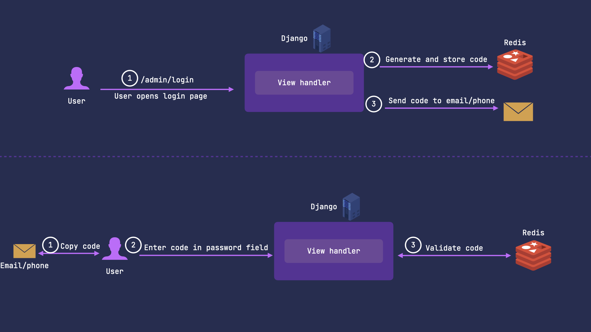
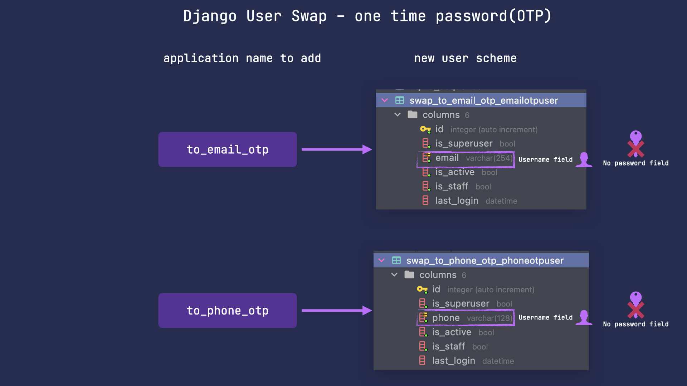

One time password(OTP) functionality allows you not to store passwords in your databases.
It lets to generate passwords valid for a certain amount of time and usable only once.
It uses redis to store and retrieve one time passwords.




## OTP models
OTP models are almost the same as other swap models.
The key difference is that they don't have password fields.



To use specified model with OTP functionality follow the steps below.
### Step 1 - change `INSTALLED_APPS`
Add the following apps below to `INSTALLED_APPS` in order to swap to the specified OTP model.

=== ":material-email-lock: to_email_otp"

    ``` python
    "swap_user",
    "swap_user.to_email_otp",
    ```

=== ":material-phone-lock: to_phone_otp"

    ``` python
    "swap_user",
    "swap_user.to_phone_otp",
    ```

---

### Step 2 - set `AUTH_USER_MODEL`
=== ":material-email-lock: to_email_otp"

    ``` python
    AUTH_USER_MODEL = "swap_to_email_otp.EmailOTPUser"
    ```

=== ":material-phone-lock: to_phone_otp"

    ``` python
    AUTH_USER_MODEL = "swap_to_phone_otp.PhoneOTPUser"
    ```

---

### Step 3 - replace `django.contrib.admin`
In order to render django admin pages properly with one time password login enabled you should replace `django.contrib.admin` in
your `INSTALLED_APPS` to the one below:

=== ":material-email-lock: to_email_otp"

    ``` python hl_lines="2 3"
    "swap_user.apps.OTPSiteConfig",
    ```

=== ":material-phone-lock: to_phone_otp"

    ``` python
    "swap_user.apps.OTPSiteConfig",
    ```

---

### Step 4 - apply migrations
=== ":material-email-lock: to_email"

    ``` sh
    python manage.py migrate swap_to_email
    ```

=== ":material-phone-lock: to_phone"

    ``` sh
    python manage.py migrate swap_to_phone
    ```

---

### Step 4 - install redis cache libraries
=== "older than django 4.0"

    ``` sh
    pip install django-redis redis
    ```

=== "django 4.0 or later"

    ``` sh
    pip install redis
    ```

---

### Step 5 - set redis as cache in settings
=== "older than django 4.0"

    ``` python
    CACHES = {
        "default": {
            "BACKEND": "django_redis.cache.RedisCache",
            "LOCATION": "redis://127.0.0.1:6379/1",
            "OPTIONS": {
                "CLIENT_CLASS": "django_redis.client.DefaultClient",
            }
        }
    }
    ```

=== "django 4.0 or later"

    ``` python
    CACHES = {
        'default': {
            'BACKEND': 'django.core.cache.backends.redis.RedisCache',
            'LOCATION': 'redis://127.0.0.1:6379',
        }
    }
    ```

---

### Step 6 - set sender class

=== ":material-email-lock: to_email_otp"

    ``` python
    SWAP_USER = {
        "OTP_SENDER_CLASS": "swap_user.otp.senders.EmailOTPSender",
    }
    ```

=== ":material-phone-lock: to_phone_otp"

    ``` python
    # For phones otp you need to define your own sender class
    # sender.py
    from swap_user.otp.senders import AbstractOTPSender

    class MyPhoneOTPSender(AbstractOTPSender):

        def send(self, receiver: str, otp: str, **kwargs):
            # implement your logic here.
            # For example, interaction with sms/push API.
            pass

    ...
    # settings.py
    SWAP_USER = {
        "OTP_SENDER_CLASS": "<path_to_your_sender_class>",
    }
    ```

---


### Email OTP showcase - login into the admin


### Custom sender class
By `sender` we mean class that sends your one time password over a specified transprot(using email, sms, push, etc).
You can implement any custom sender class and use this as your transport backend.

Example is shown below.
``` python
from swap_user.otp.senders import AbstractOTPSender


class PushNotificationsOTPSender(AbstractOTPSender):
    """
    Sending code over push.
    """

    def send(self, receiver: str, otp: str, **kwargs):
        PushAPI.send(to=receiver, title='Use this code', text=otp)

```

Then include your class path into the settings:
``` python

# settings.py
SWAP_USER = {
    "OTP_SENDER_CLASS": "<path_to_your_sender_class>",
}

```


