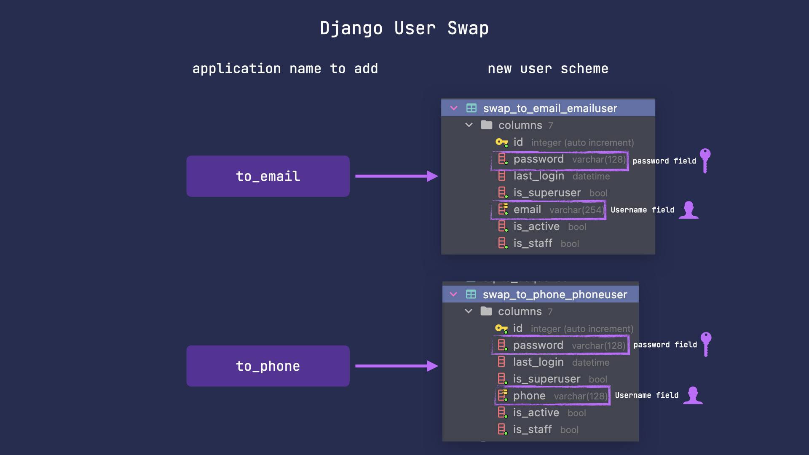

Basic functionality provided by this package includes user models with `phone` or `email` as username.



To use specified model follow the steps below.
### Step 1 - change `INSTALLED_APPS`
Add the following apps below to `INSTALLED_APPS` in order to swap to the specified model.

=== ":material-email-plus: to_email"

    ``` python
    "swap_user",
    "swap_user.to_email",
    ```

=== ":material-phone-plus: to_phone"

    ``` python
    "swap_user",
    "swap_user.to_phone",
    ```

---

### Step 2 - change `AUTH_USER_MODEL`
=== ":material-email-plus: to_email"

    ``` python
    AUTH_USER_MODEL = "swap_to_email.EmailUser"
    ```

=== ":material-phone-plus: to_phone"

    ``` python
    AUTH_USER_MODEL = "swap_to_phone.PhoneUser"
    ```

---

### Step 3 - apply migrations
=== ":material-email-plus: to_email"

    ``` sh
    python manage.py migrate swap_to_email
    ```

=== ":material-phone-plus: to_phone"

    ``` sh
    python manage.py migrate swap_to_phone
    ```

---


